<h2>Vérifier si Docker est installé sur la VM</h2>
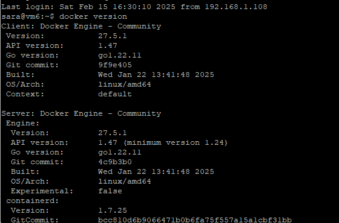
<h2>Après la création du projet, on va le pousser sur GitHub </h2>
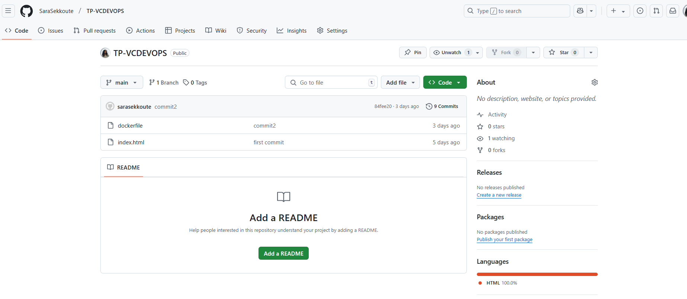
<h1>Partie 1 : CI</h1>
<h2>Création d'une variable d'environnement dans Jenkins avec l'IP de la VM</h2>
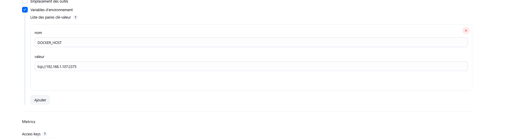
<h2>Après l’installation de Jenkins, on va créer un item de type Freestyle<h2>
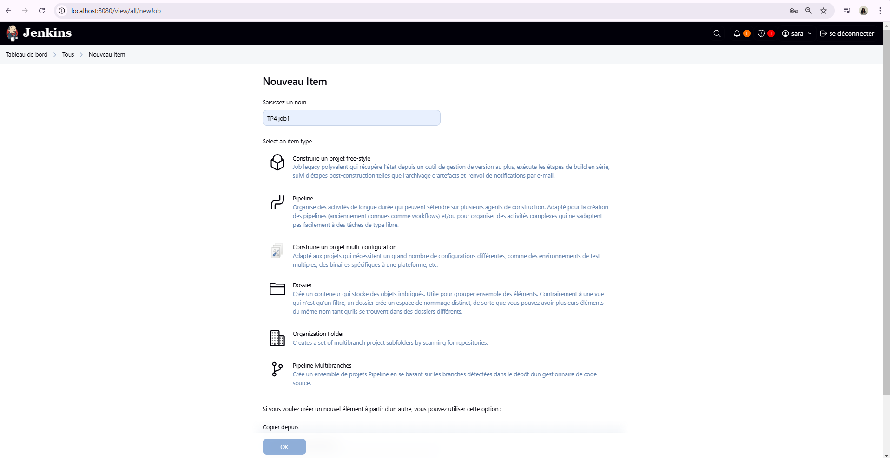
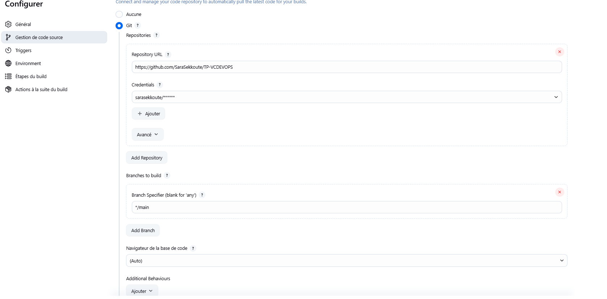
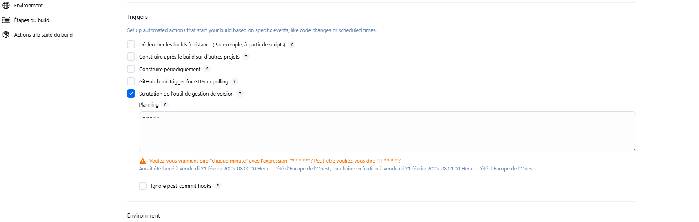

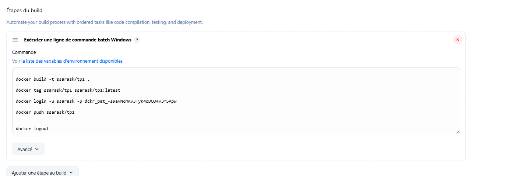

l'image a été construite avec succès

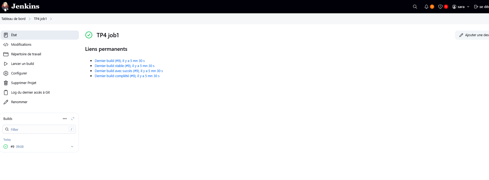

 l'image est créée sur Docker Hub avec succès

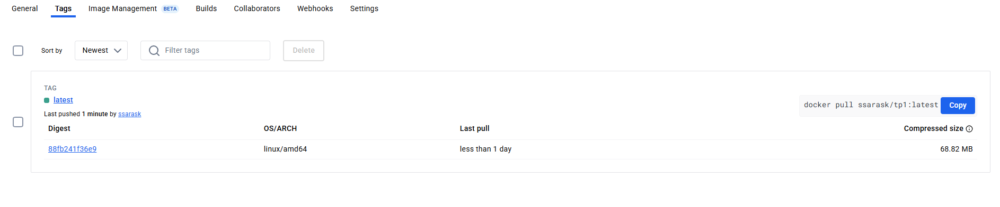

pour supprimer Job

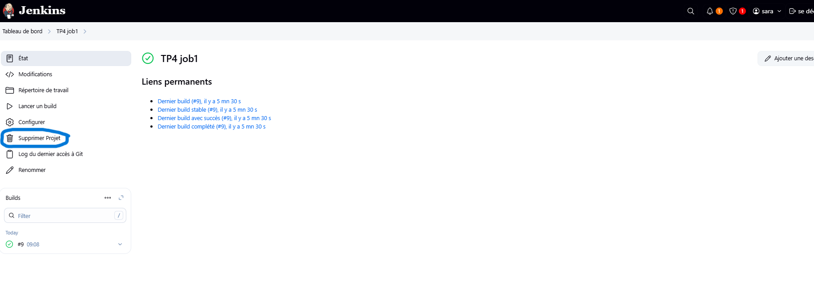
<h1>Partie 2: CI/CD (continuous integration/continuous deployment)</h1>
Créer un autre job freestyle job2tp4 contenant les mêmes instructions du
job1tp4 de la première partie tout en ajoutant un script Shell qui déploie l’image
sous un nouveau conteneur sur docker engine

Avant

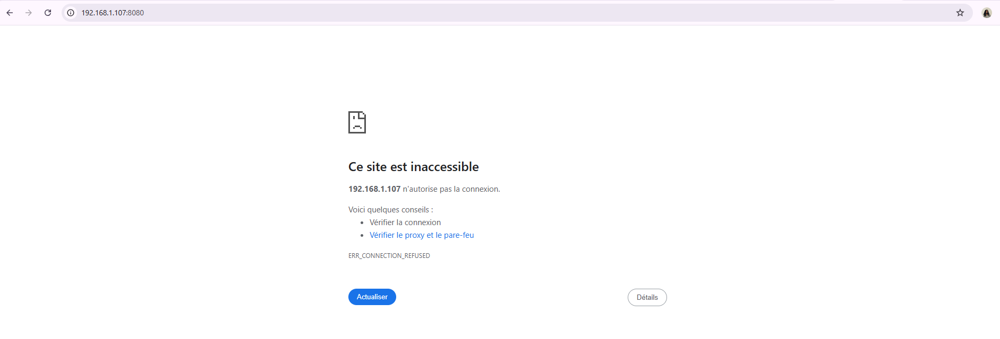

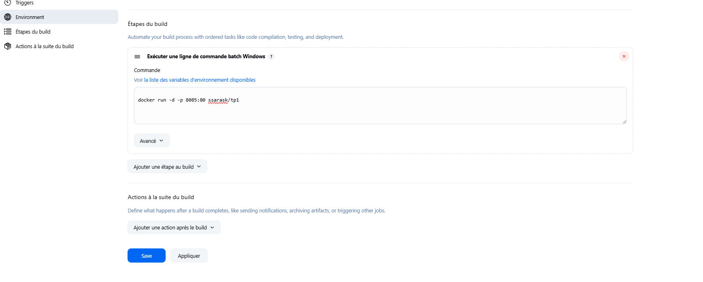

Apres

Faire un changement dans index.html, découvrir les changements sur le job2tp4
et sur l’image déployé
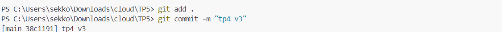
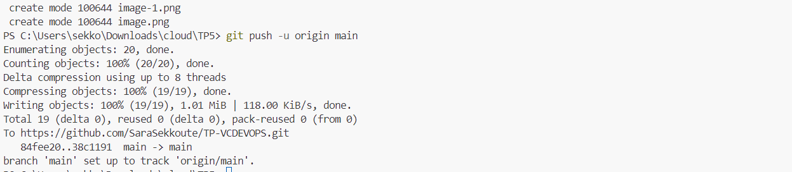
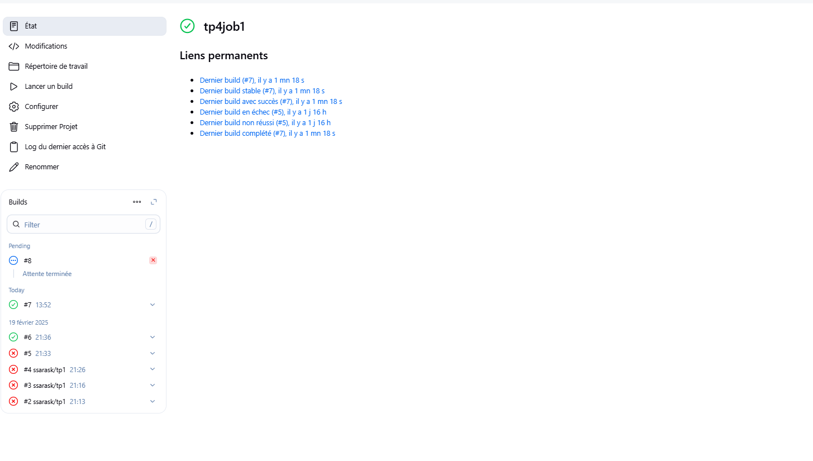
Créer un job du type pipeline job2tp4v2 (qui reprend les mêmes tâches du job
freestyle job2tp4 mais d’une autre manière), ajouter sans rien changer dans les
paramètres du job, un script dans la partie script du pipeline assurant les trois
stages (Cloning Git, Building image, Publish Image)
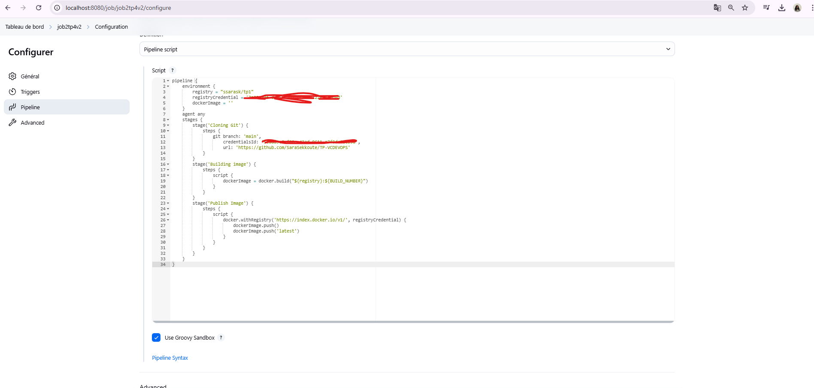
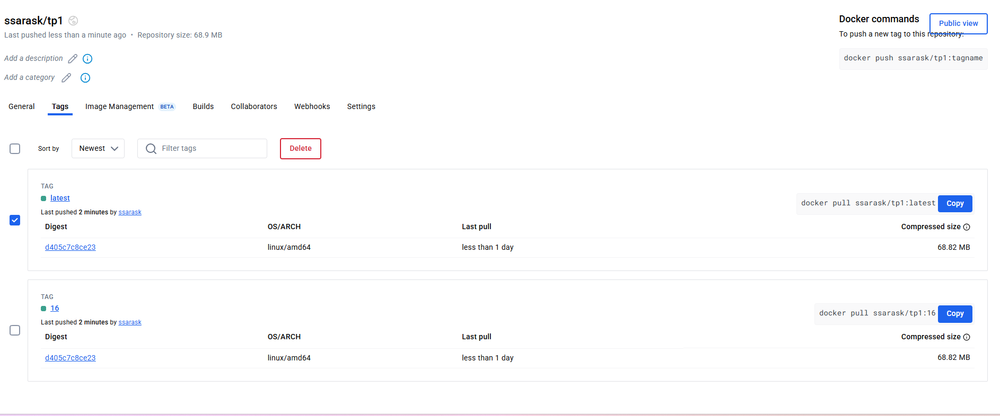
Créer un job du type pipeline (job3tp4). Ce dernier cinq Stages (Cloning Git, Building
image, Test image, Publish Image, deploy image).. Sur le même projet
TP4, créer un fichier ‘jenkinsfile’ qui définit le script assurant les cinq stages,
par la suite spécifier sur le job le chemin du fichier ‘jenkinsfile’.
Créer le Jenkins file sur le dépôt local et faire le push de ce dernier sur le dépôt
distant
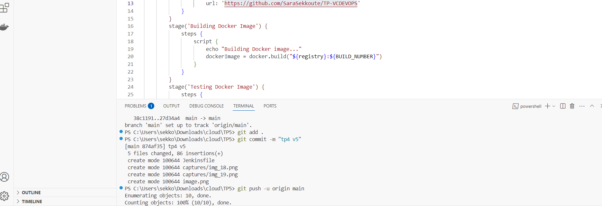
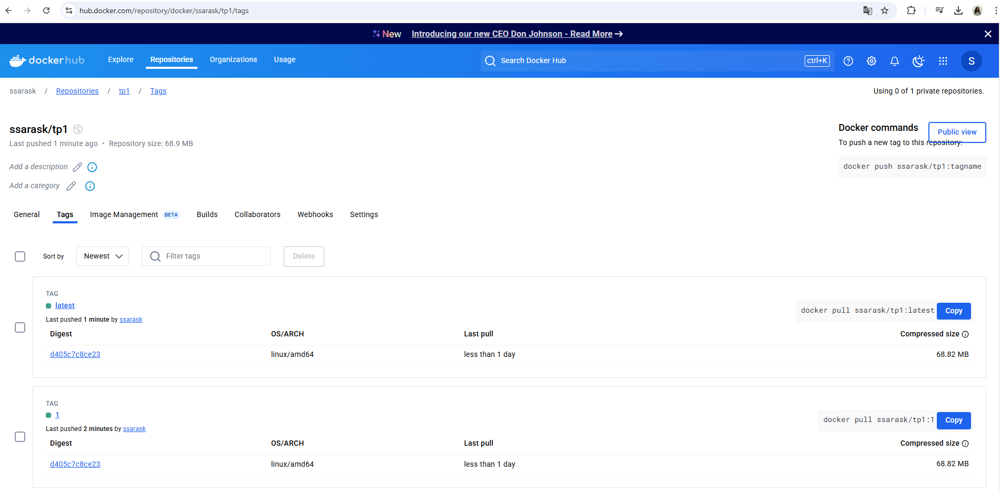
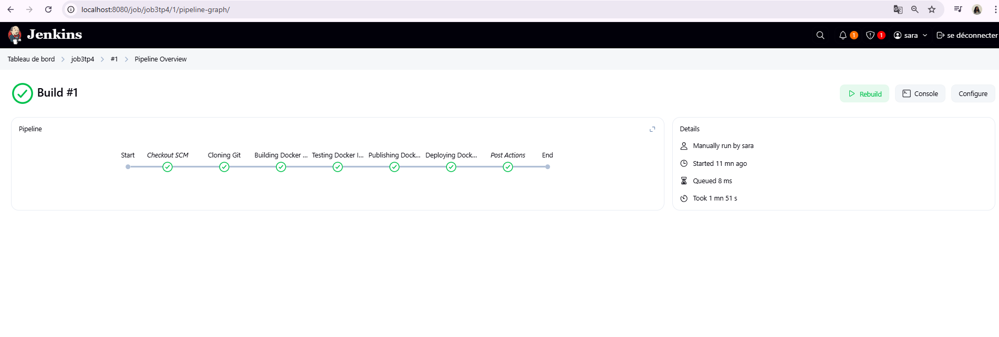

