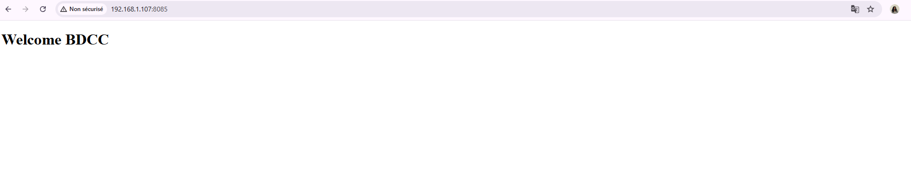

<h2>Vérifier si Docker est installé sur la VM</h2>

<h2>Ajouter une variable d'environnement sur la machine hôte qui contient l'adresse IP de cette VM</h2>

<h2>Après la création du projet, on va le pousser sur GitHub </h2>

<h1>Partie 1 : CI</h1>
<h2>Création d'une variable d'environnement dans Jenkins avec l'IP de la VM</h2>

<h2>Après l’installation de Jenkins, on va créer un item de type Freestyle<h2>

l'image a été construite avec succès

 l'image est créée sur Docker Hub avec succès

pour supprimer Job

<h1>Partie 2: CI/CD (continuous integration/continuous deployment)</h1>

Avant

Apres

